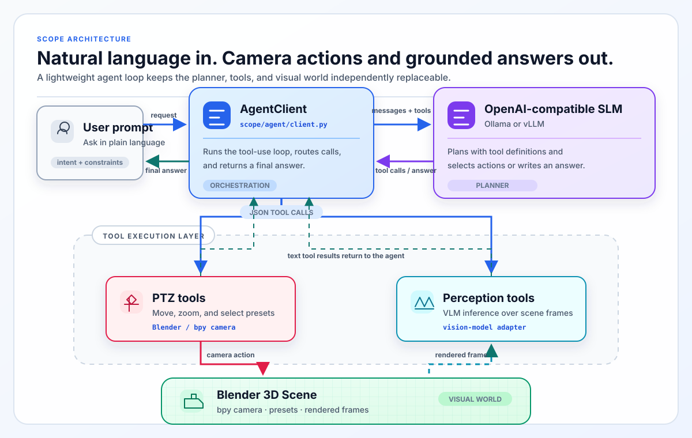

# SCOPE

**A Natural-Language PTZ Camera Agent That Runs Entirely at the Edge**

SCOPE is an edge-focused, tool-using agent for pan–tilt–zoom (PTZ) camera work: a small language model plans, vision tools inspect frames, and camera tools act in a loop. This public repository is the reproducible Blender implementation, benchmark, and evaluation harness for that loop.

[](https://doi.org/10.1145/3757279.3785641)
[](https://arxiv.org/abs/2606.02951)
[](https://huggingface.co/datasets/HindsboNikolaj/scope-benchmark)
[](https://huggingface.co/spaces/HindsboNikolaj/scope)
[](https://huggingface.co/collections/HindsboNikolaj/scope-hri-26-6a1626e0b8e9b9205c09fffc)


> Research demonstration: the HRI system drives a physical AXIS PTZ camera with the same high-level agent design. The public repository preserves the runnable Blender-side tools and benchmark; it does **not** publish the AXIS driver or make a hardware deployment claim.

---

## A request becomes a control loop

“Go to the highway preset, then pan right in 15-degree steps until you see at least six cones” is not a single image question. The planner must select a viewpoint, move the camera, ask for visual evidence, decide whether the evidence is enough, and repeat before it answers.

SCOPE makes that loop inspectable. Every run records the tool calls, their structured arguments, the short text observations returned to the planner, timings, and the final answer that the evaluator scores.

| The research problem | What the public repository gives you | Why it matters to a builder |
| --- | --- | --- |
| A camera agent must act, observe, and decide again | A Blender camera with presets plus a nine-tool agent loop | You can reproduce the control loop without a physical camera integration |
| A live scene changes while models are being compared | Versioned scenes, questions, expected answers, and run traces | You can isolate a model, prompt, or tool change rather than compare two different days in the field |
| A good answer must be attributable | Tool-call and answer scoring through an LLM-as-judge harness | You can inspect where a run failed: routing, action arguments, perception, or the final response |

## Choose your path

| If you want to… | Start here | You will leave with… |
| --- | --- | --- |
| Run the complete loop in simulation | [Quick start](#quick-start) | A five-task Blender smoke run through runner, judge, and metrics |
| See how an agent reasons over tools | [Architecture](#architecture-plan-act-observe-answer) | The planner/tool/scene boundary and the trace it produces |
| Add a camera or perception capability | [Add a tool](#add-a-tool) | A runnable Blender tutorial and the persistent extension points |
| Compare planner and vision choices | [Published results](#published-results) | Paper numbers with their exact 536-task scope and model types |
| Change serving backends | [`docs/CONFIGURATION.md`](docs/CONFIGURATION.md) | Ollama, vLLM, hosted planner, and VLM configuration details |
| Hand setup to Claude Code or Codex | [`AGENT_INSTRUCTIONS.md`](AGENT_INSTRUCTIONS.md) | A prerequisite-first install brief that stops at the first failure |

## Architecture: plan, act, observe, answer


> The Blender demonstration is the runnable path in this repository. Its trace shows each planner turn, tool call, visual observation, and answer rather than hiding the loop behind a single response.



[`AgentClient`](src/scope/agent/client.py) sends the nine function definitions in [`src/scope/tools/schema.json`](src/scope/tools/schema.json) to a planner through an OpenAI-compatible chat/tool-calling API. A planner response is either a final answer or a tool call; SCOPE dispatches the call, appends its text result to the conversation, and repeats until the task ends.

The split is deliberate. Perception tools call a configured VLM only when needed and return compact, task-specific text—counts, OCR, attributes, or locations—rather than adding raw image tokens to every planner turn. Camera control, perception, and planning can therefore be changed and measured independently.

### The action surface

| Tool family | Shipped tools | Blender-side behavior |
| --- | --- | --- |
| Camera control | `ptz_adjust`, `go_to_preset`, `home_action`, `get_presets`, `take_image` | Moves the active `bpy` camera, selects a preset, or captures a frame |
| Perception | `count_pointing`, `query_answer`, `zoom_bounding` | Captures a frame or panorama and delegates the visual query to the configured VLM |
| Stateful capability | `track_object` | Exposes the tool contract in simulation; treat it as a simulation stub, not a deployed tracker |

The paper describes a real-camera research deployment behind the same kind of high-level tool contract. This repository contributes the Blender implementation of that boundary and its repeatable evaluation path—not public AXIS backend code.

## Why a Blender twin?

Static image benchmarks cannot measure whether a model made the right second look. A real camera can show that an agent works, but moving traffic, changing light, and a different scene tomorrow make a model comparison noisy; the Blender twin holds the world fixed while the agent changes.

| Closed-loop question | SCOPE’s answer | Observable evidence |
| --- | --- | --- |
| Did the planner choose the next useful action? | Give it a fixed, inspectable tool surface | Tool name, JSON arguments, order, and trace |
| Did perception support the decision? | Put VLM calls behind count, query, and object-framing tools | Returned observation, frame/panorama scope, and VLM timing |
| Did a configuration improve the actual task? | Replay tasks against known scenes, presets, and expected answers | Per-task output, judge decision, aggregate metrics |
| Can I safely change one part of the system? | Keep planner, perception, and camera execution separate | A focused rerun instead of a rewrite of the agent loop |

The repository ships the agent loop, nine Blender-facing tool definitions, VLM adapters, a **541-row** benchmark CSV, and an LLM-as-judge evaluation harness. The published HRI scorecard is a separate **536-task** subset; its relationship to the five additional shipped rows is not established by the public Git history.

## Quick start

Run these commands from the repository root. You need Python 3.10+, Blender 4.0+, an OpenAI-compatible planner endpoint, and a VLM; a judge endpoint is required for the full evaluation pipeline.

```bash
# 1. Create an isolated Python environment and install SCOPE.
python3 -m venv .venv
source .venv/bin/activate
bash scripts/01_install.sh

# 2. Edit .env. At minimum configure a planner (AGENT_API_BASE,
#    AGENT_MODEL_ID, AGENT_API_KEY), a VLM, and a judge for evaluation.

# 3. The local Ollama route only: pull a planner model.
#    Skip this command when using vLLM or a hosted OpenAI-compatible endpoint.
bash scripts/02_pull_models.sh qwen3:30b-a3b

# 4. Download Blender scenes, install their camera presets, and smoke-test
#    the entire runner → judge → metrics pipeline.
bash scripts/03_download_scenes.sh
"${BLENDER_BIN:-blender}" --background --python scripts/04_install_presets.py
BENCH_LIMIT=5 SCOPE_RESUME=0 bash scripts/run_eval_pipeline.sh
```

If Blender is not on `PATH`, set `BLENDER_BIN` in `.env`; on macOS that is commonly `/Applications/Blender.app/Contents/MacOS/Blender`. The evaluator intentionally opens Blender **with a UI** because screenshot capture needs 3D viewport context; `--background` is used above only for the preset installer.

For agent-assisted setup, paste [`AGENT_INSTRUCTIONS.md`](AGENT_INSTRUCTIONS.md) into a fresh Claude Code or Codex session.

## Add a tool

Start with the runnable [custom-tool tutorial](examples/add_new_tool.py):

```bash
blender my_scene.blend --python examples/add_new_tool.py
```

It registers a `measure_distance` tool for that Blender process, verifies the schema/function registration, and calls it directly against two scene objects. Set `SCOPE_RUN_AGENT_DEMO=1` only after configuring a planner endpoint if you also want to ask a live agent to select the tool.

For a persistent SCOPE tool, make both parts of the contract explicit:

1. Add its function schema to [`src/scope/tools/schema.json`](src/scope/tools/schema.json).
2. Implement a Python function with matching keyword arguments in [`src/scope/tools/blender_tools.py`](src/scope/tools/blender_tools.py); return at least `result`, with timings when they matter to evaluation.
3. Add benchmark rows or an integration test before treating the new capability as measured.

### Use SCOPE from another runtime or camera

SCOPE’s shipped declaration is **OpenAI-compatible function-calling JSON**, and its shipped execution layer is Python in Blender. MCP is a separate client/server protocol with its own transport and result conventions; an OpenAI-compatible tool schema is not an MCP server definition.

To expose a SCOPE capability through MCP or another agent runtime, write a thin adapter: map that runtime’s tool declaration and request payload to the SCOPE function arguments, invoke the implementation, and translate `result`, errors, and timings back into the runtime’s result format. Keep the mapping and validation explicit rather than assuming schemas or wire formats are interchangeable.

To attach a physical camera, implement and validate an adapter for the device/vendor API you operate. The paper and GIF above document real AXIS-camera research work, but this public repository does not contain an AXIS backend to reuse or imply production readiness.

## Published results

**Scope of these numbers:** the HRI paper reports GPT-4o-judged results on a supported **536-task published subset**. The historical [`benchmark/scope_536.csv`](benchmark/scope_536.csv) filename now contains **541 shipped rows**; five shipped rows fall outside the published subset. Public Git history begins with the 541-row CSV, so it does not establish a task-by-task provenance story for those rows. Report a fresh 541-task run separately rather than comparing it directly with the paper values below.

The paper evaluates 19 planner–perception pairings. This selected view makes the architectural comparison legible; the full published matrix is in [`docs/RESULTS_FULL.md`](docs/RESULTS_FULL.md).

| Published configuration | Planner type | Average accuracy (536 tasks) | Reading it |
| --- | --- | :---: | --- |
| Qwen3-30B-A3B + Moondream3 | MoE | **73.8%** | Best reported configuration |
| Qwen3-Next-80B-A3B + Moondream2 | MoE | 70.6% | Second-highest published configuration |
| Qwen3-30B-A3B-FP8 + Moondream3 | MoE | 69.1% | Quantized counterpart of the best planner family |
| Qwen3-32B + Moondream3 | Dense | 68.8% | Highest published dense-planner configuration |
| Qwen3-Next-80B-A3B + Qwen2.5-VL-7B | MoE | 68.3% | Cross-family vision comparison |

`MoE` and `Dense` are the planner architectures reported in the paper. The paper’s interpretation is not that one model answers every PTZ question by itself: stronger planners improve tool selection and sequencing, while perception becomes the dominant remaining limitation for stronger planner pairings.

## Run the benchmark

```bash
./scripts/run_eval_pipeline.sh configs/agent_config.yaml results/
```

| Variable | Default | Use it when… |
| --- | --- | --- |
| `BENCH_LIMIT` | `0` | You want a smoke test; set `5` before committing to a full run |
| `SCOPE_RESUME` | `1` | You want to continue a partial run; set `0` for a clean run |
| `REPEATS` | `1` | You need repeated executions per question |
| `QUESTIONS_CSV` | `benchmark/scope_536.csv` | You want a different input; the default file currently contains 541 rows |
| `OUT_CSV` | `results/run_<timestamp>/raw_results.csv` | You want to retain or resume a particular raw-results file |

The pipeline runs the Blender runner, judges the trace and final response, and prints aggregate metrics. See [`benchmark/README.md`](benchmark/README.md) for the CSV schema and task categories, [`docs/CONFIGURATION.md`](docs/CONFIGURATION.md) for backend setup, and [`docs/architecture.md`](docs/architecture.md) for the complete loop and extension points.

## Repository guide

| Location | Contents |
| --- | --- |
| [`src/scope/`](src/scope/) | Agent loop, Blender helpers, tools, VLM clients, runner, and judge |
| [`benchmark/`](benchmark/) | The 541-row CSV and camera presets; scene downloads stay out of Git for size |
| [`configs/`](configs/) | Planner/VLM configurations and paper pairing presets |
| [`prompts/`](prompts/) | The live planner system prompt and judge prompts |
| [`examples/`](examples/) | Quick start, custom model, and custom tool tutorials |
| [`docs/`](docs/) | Configuration, architecture, tool reference, results, and scene-authoring detail |

## Citation

```bibtex
@inproceedings{Armada2026SCOPE,
  title         = {SCOPE: A Real-Time Natural Language Camera Agent at the Edge:
                   A Sim-to-Real Benchmark and Analysis of Open-Source Vision
                   and Language Agents for PTZ Camera Tasks},
  author        = {Hindsbo, Nikolaj and Ehsani, Sina and Mishra, Pragyana},
  booktitle     = {Proceedings of the ACM/IEEE International Conference on
                   Human-Robot Interaction (HRI '26)},
  year          = {2026},
  publisher     = {ACM},
  doi           = {10.1145/3757279.3785641},
  eprint        = {2606.02951},
  archivePrefix = {arXiv},
  primaryClass  = {cs.RO},
}
```

## License

MIT. See [LICENSE](LICENSE).
