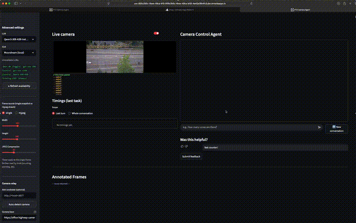
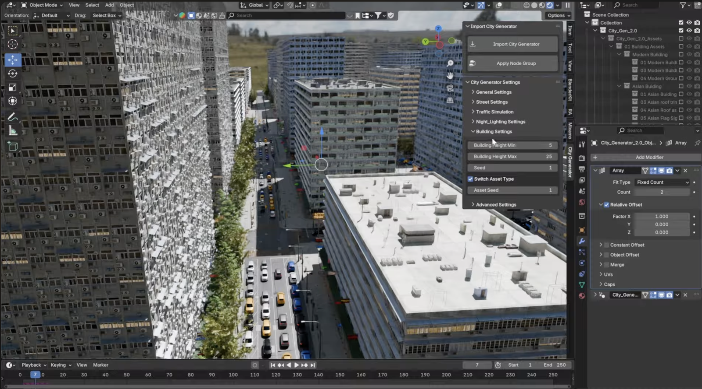
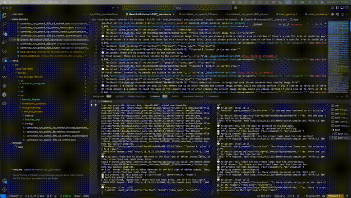

# SCOPE

**Simulation and Camera Operations for Perception and Evaluation.**
A modular multimodal agent for natural-language PTZ camera control,
designed for edge deployment and built to be benchmarked the same way
in Blender simulation and on a real AXIS camera. Published at **HRI 2026**.

[](https://doi.org/10.1145/3757279.3785641)
[](https://huggingface.co/datasets/HindsboNikolaj/scope-benchmark)
[](https://huggingface.co/spaces/HindsboNikolaj/scope)
[](https://huggingface.co/collections/HindsboNikolaj/scope-hri-26-6a1626e0b8e9b9205c09fffc)



> *Above: real AXIS PTZ camera in our office. Same agent, same exposed
> tool schema; only the planner LLM changes between runs (Qwen3-30B-A3B
> MoE vs the dense Qwen3-32B). The visible difference is speed.*

---

## What it is

A small language model picks actions. A vision-language model handles
perception. They talk to a fixed action space — pan/tilt/zoom,
preset navigation, capture, plus VLM-backed counting, VQA, detection,
and tracking — exposed as an **OpenAI-compatible tool schema** (the same
tool-calling pattern OpenAI, Anthropic's MCP, and most modern agent
runtimes share). The schema is *byte-identical* between Blender simulation
and the physical AXIS PTZ, so anything you measure in sim transfers without
re-plumbing the agent.

The repo ships:

- The full agent loop and the 9-tool action space.
- A **536-task benchmark** across 8 categories
  (counting, descriptor, location/spatial, OCR, single-call,
  multi-step command, multi-step reasoning, comparative/relational).
- An **LLM-as-Judge** evaluation harness with per-category metrics.
- A repack-safe Blender simulation environment with shared scene presets.
- Per-category judge prompts and the SLM planner system prompt.

---

## Architecture



The planner is a Small Language Model (Qwen3 family by default). It
interleaves *reasoning* with *tool calls*. Each tool resolves either to a
camera-control primitive (PTZ moves, preset navigation, capture) or to a
perception call back into a VLM (Moondream / Qwen-VL). The first kind is
a primitive; the rest are short **workflows** — multi-step routines like
*zoom-to-bounding-box* or *count-by-pointing* that the planner can invoke
as if they were a single skill. Full per-tool params and return types are
in [`docs/tool_reference.md`](docs/tool_reference.md).

---

## Quick start

### For humans

```bash
# 1. Install
python -m pip install -e .
cp .env.example .env
# edit .env: AGENT_API_BASE, AGENT_MODEL_ID, MOONDREAM_API_KEY (or VLM_BASE_URL),
# OPENAI_API_KEY (or JUDGE_API_BASE), BLENDER_BIN if needed
set -a; source .env; set +a

# 2. Prepare environment (system tools + models + scenes + Blender presets)
bash scripts/01_install.sh
bash scripts/02_pull_models.sh qwen3:30b-a3b    # Ollama path; skip if using vLLM / hosted API
bash scripts/03_download_scenes.sh              # ~GB of .blend scenes from Hugging Face Hub
"${BLENDER_BIN:-blender}" --background --python scripts/04_install_presets.py

# 3. 5-task smoke benchmark (full pipeline: runner → judge → metrics)
BENCH_LIMIT=5 SCOPE_RESUME=0 bash scripts/run_eval_pipeline.sh
```

If Blender isn't on `PATH`, set `BLENDER_BIN` in `.env`
(macOS default: `/Applications/Blender.app/Contents/MacOS/Blender`).
If `python3` and `pip` point at different interpreters, set `PYTHON_BIN`
in `.env` so the judge and metrics stages use the same Python that
installed `scope-agent`.

### For an AI agent

Paste [`AGENT_INSTRUCTIONS.md`](AGENT_INSTRUCTIONS.md) into a Claude Code
or Codex session. The agent will walk through prerequisites,
fill `.env`, run the setup scripts, and stop at the first failure.

---

## Running the benchmark

```bash
./scripts/run_eval_pipeline.sh configs/agent_config.yaml results/
```

Common knobs (all env-var driven; full list in
[`docs/CONFIGURATION.md`](docs/CONFIGURATION.md)):

| Var | Default | What it does |
| --- | --- | --- |
| `BENCH_LIMIT` | `0` | Cap to first N questions. Set to `5` for smoke tests |
| `SCOPE_RESUME` | `1` | Skip qids that already have a non-empty `final_answer`. Set `0` for a fresh run. Blender can occasionally crash mid-run; `SCOPE_RESUME=1` is the right default |
| `REPEATS` | `1` | Repeats per question |
| `QUESTIONS_CSV` | `benchmark/scope_536.csv` | Input question set |
| `OUT_CSV` | `results/run_<ts>/raw_results.csv` | Pin this to resume into a specific file |

> **Note:** the pipeline launches Blender *without* `--background` —
> screenshot capture needs a real 3D viewport. The only setup step that
> uses `--background` is `04_install_presets.py`, which doesn't need UI.



> *Above: agent in Blender across three scenes. The terminal trace on the
> left logs every tool call, VLM response, and planner reasoning step.*

---

## Top-5 results

| Rank | SLM | VLM | Overall accuracy |
|:----:|-----|-----|:----------------:|
| 1 | Qwen3-30B-A3B | Moondream3 | **73.8 %** |
| 2 | Qwen3-30B-A3B | Qwen2.5-VL-7B | 72.4 % |
| 3 | Qwen3-32B | Moondream3 | 71.6 % |
| 4 | Qwen3-32B | Qwen2.5-VL-7B | 70.9 % |
| 5 | Qwen3-30B-A3B | Moondream2 | 69.5 % |

Full 20-configuration matrix and per-category breakdowns in
[`docs/RESULTS_FULL.md`](docs/RESULTS_FULL.md). The headline finding from
the paper: MoE planners consistently match or exceed dense planners at the
same parameter budget, and quantization barely moves accuracy.

---

## Repo layout

```
SCOPE_HRI26.pdf                  Published HRI '26 paper
README.md                        You are here
AGENT_INSTRUCTIONS.md            Paste-into-Claude/Codex setup brief

src/scope/                       Agent loop, tool dispatch, runner, judge
benchmark/                       The 536-task CSV + Blender camera presets
configs/                         Agent + judge YAML configs
prompts/                         SLM planner system prompt + judge prompts
scripts/                         Numbered setup + per-stage scripts
docs/                            Architecture, config, full results, etc.
examples/                        Minimal usage examples (quick_start, add_new_tool, custom_model)
```

---

## Documentation

- [`AGENT_INSTRUCTIONS.md`](AGENT_INSTRUCTIONS.md) — setup brief for Claude Code / Codex
- [`docs/architecture.md`](docs/architecture.md) — agent loop, tool dispatch, project layout
- [`docs/tool_reference.md`](docs/tool_reference.md) — per-tool params and return types
- [`docs/CONFIGURATION.md`](docs/CONFIGURATION.md) — model hosting, env vars, full YAML reference
- [`docs/RESULTS_FULL.md`](docs/RESULTS_FULL.md) — all 20 SLM+VLM combinations + per-category metrics
- [`docs/creating_scenes.md`](docs/creating_scenes.md) — adding new Blender scenes
- [`SCOPE_HRI26.pdf`](SCOPE_HRI26.pdf) — the paper

---

## Citation

```bibtex
@inproceedings{Armada2026SCOPE,
  title     = {SCOPE: A Real-Time Natural Language Camera Agent at the Edge:
               A Sim-to-Real Benchmark and Analysis of Open-Source Vision
               and Language Agents for PTZ Camera Tasks},
  author    = {Hindsbo, Nikolaj and Ehsani, Sina and Mishra, Pragyana},
  booktitle = {Proceedings of the ACM/IEEE International Conference on
               Human-Robot Interaction (HRI '26)},
  year      = {2026},
  publisher = {ACM},
  doi       = {10.1145/3757279.3785641},
}
```

---

## License

MIT. See [LICENSE](LICENSE).
