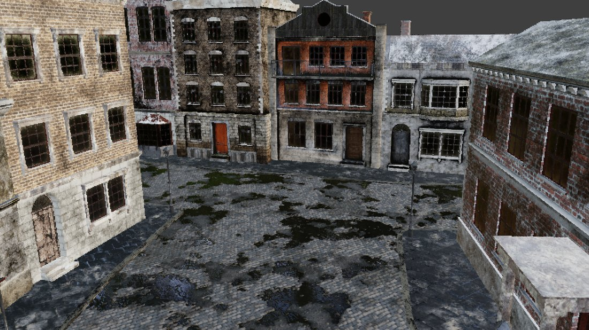
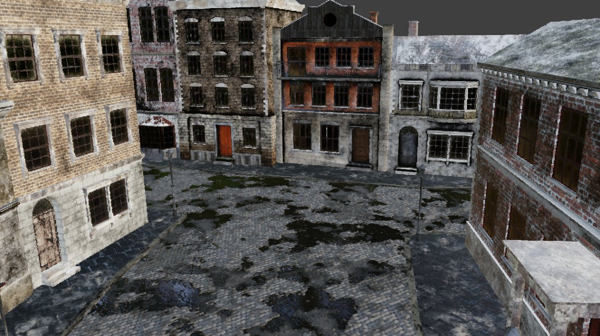
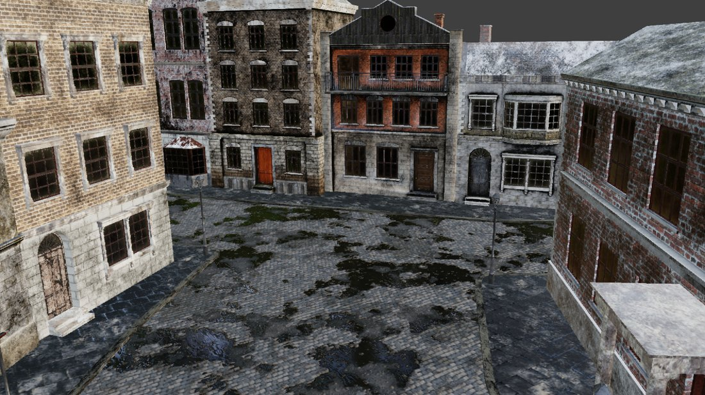
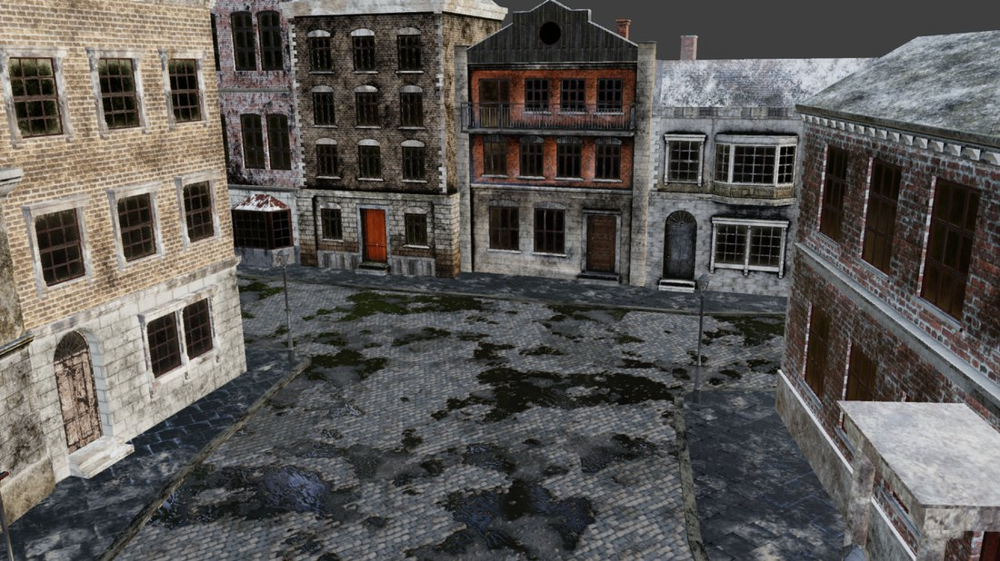
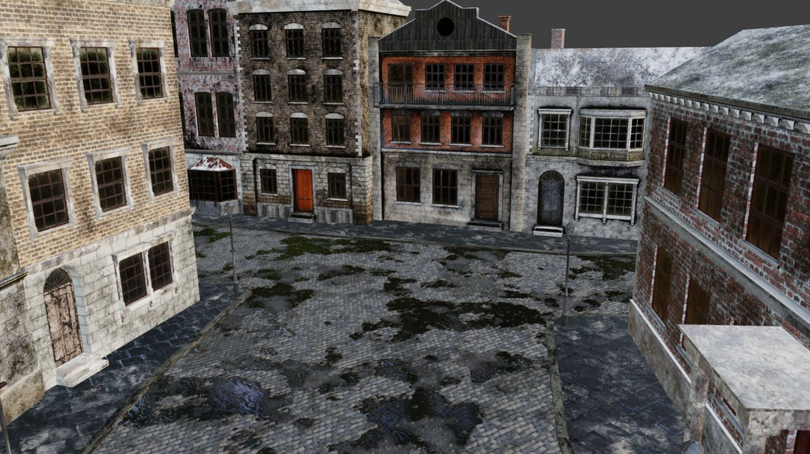

# Why a scene needs time before you photograph it

`bpy.ops.wm.open_mainfile()` returns before the scene can be drawn. The file is parsed, the
objects exist, the camera is where the preset says it is, and every Python query you can think
of answers correctly. The viewport is still empty. Textures stream in afterwards, and shaders
are compiled the first time the GPU is asked to draw with them.

So a capture taken immediately after opening a file is not a picture of the scene. It is a
picture of a scene that has not loaded yet, and nothing in the API says so.

## What it looks like

Whitechapel, opened and then captured at increasing delays. Same camera, same shading, same
code. The only variable is how long the process waited.

| | |
|---|---|
|  **0.0s** — blank. 92% of pixels differ from settled. |  **2s** — geometry is there, materials are not. 35% differ. |
|  **4s** — still 32% wrong. Looks plausible enough to trust, which is the dangerous part. |  **8s** — 11% differ, mostly texture detail. |
|  **12s** — 2.7% differ. First frame that is usable. |  **20s** — identical to every later capture. |

The measured curve, against the frame at 40 seconds:

| delay | mean abs. error | pixels differing | verdict |
|------:|----------------:|-----------------:|---------|
| 0.0s | 44.79 | 91.7% | blank |
| 1.0s | 8.52 | 38.5% | wrong |
| 4.0s | 6.96 | 31.8% | wrong |
| 8.0s | 3.16 | 10.7% | close |
| 12.0s | 1.56 | 2.7% | usable |
| 16.0s | 1.00 | 1.0% | usable |
| 20.0s | 0.02 | 0.0% | settled |
| 25s and beyond | 0.00 | 0.0% | settled |

Nothing changes after 20 seconds. Before 12, every capture is wrong by an amount that grows
the earlier you look.

## Why this is worth a wait rather than a retry

The failure is silent. A half-loaded scene does not raise, and it does not come back grey
enough to spot in a contact sheet: at four seconds the picture is recognisably the right street
from the right angle, with the wrong surfaces on it. A vision model asked what colour a shopfront
is will answer confidently from a texture that has not arrived.

That is the same class of failure as a broken panorama being described as "a street under a dark
sky" when the image contains no sky at all. The tool did not fail. It answered.

## What SCOPE does

`SCOPE_SETTLE` sets the wait, in seconds, after any file open. The default is 15, which is on
the safe side of the 12-second usable threshold without paying for the full 20.

```bash
SCOPE_SETTLE=15    # default
SCOPE_SETTLE=25    # slower disk, or a scene larger than the four shipped ones
SCOPE_SETTLE=0     # only if you have already opened this scene in this process
```

The cost is smaller than it looks. The runner reopens a file only when the scene changes, and
the benchmark CSV is grouped by scene, so a full 541-row run performs four opens. At 15 seconds
each that is one minute across the whole run.

## Where else it matters

**Crash recovery.** `scripts/run_benchmark.py --resume` restarts from the row that failed, which
means reopening the scene. A resumed run is a cold start, so it needs the same wait a first run
does. Skipping it produces rows that look completed and are quietly wrong, which is worse than
the crash was.

**A fresh benchmark on a new machine.** Nothing is cached on first contact: no shader binaries,
no texture residency. The first scene of the first run is the slowest capture the machine will
ever do. Shader compilation alone accounts for 20 to 45 seconds on that first frame, after which
steady state is 3 to 7 seconds. Do not read the first frame's timing as the machine's speed.

**Anything that opens a file and captures in the same breath.** Smoke tests, verifiers, and
one-off scripts all have to wait. `scripts/06_verify_setup.py` does, and reports the settle time
it observed rather than assuming the default was enough.

## Reproducing the measurement

```bash
blender benchmark/scenes/whitechapel/whitechapel.blend \
  --python scripts/06_verify_setup.py -- verify_out
```

It captures at increasing delays after open, compares each against the last, and prints the
first delay at which the frame stops changing. If that number is far from 12 to 20 on your
machine, `SCOPE_SETTLE` should be set from your measurement rather than from this document.
