# Scenes at a glance

Every camera position the benchmark starts from, what it sees, and what it sees when it looks around. 10 scene-and-preset combinations across four scenes account for all 541 rows.

Both pictures are viewport screenshots in Material Preview, which is the mode captures use and the mode the vision models are shown. Neither is a Cycles render.

**2 of the 10 viewpoints are not shown here yet:** `city-street/hotel-m`, `city-street/mailbox`.

`city-street` costs about 75 minutes a frame in Material Preview under software OpenGL, where the other three scenes cost 6 to 19 seconds, so a ten frame sweep of it is not practical on a machine without a display. That is a property of its materials rather than of its size: it is the smallest of the four by pixel count. See [SETUP.md](SETUP.md) for the per-scene numbers.

## The breakdown

| scene | preset | rows start here | of those, full-view | panorama |
|---|---|---:|---:|---|
| `book-nook` | `road1` | 56 | 8 | 10 frames, 36° step, 164s |
| `book-nook` | `store-front` | 56 | 9 | 10 frames, 36° step, 530s |
| `book-nook` | `store-front2` | 56 | 9 | 10 frames, 36° step, 158s |
| `postwar-city` | `diff-view-1` | 40 | 5 | 9 frames, 40° step, 104s |
| `postwar-city` | `street-view-1` | 40 | 6 | 9 frames, 40° step, 67s |
| `postwar-city` | `street-view-2` | 40 | 6 | 9 frames, 40° step, 62s |
| `whitechapel` | `eor-viewpoint` | 68 | 10 | 10 frames, 36° step, 191s |
| `whitechapel` | `sor-viewpoint` | 65 | 10 | 10 frames, 36° step, 141s |
| | **total** | **421** | **63** | |

A *full-view* row is one whose `answer_view` is `full`: the question cannot be answered from the starting frame, so the agent has to look around first. There are 93 of them across the whole benchmark, and every viewpoint has some, so every viewpoint needs a full view that works. It does not follow that every viewpoint needs a panorama, which is the next section.

## The full view is not the same shape at every viewpoint

A 360 degree sweep is the obvious way to give an agent more than its starting frame, and it is the wrong shape at several of these viewpoints. Two things are measured for each candidate: *content*, how much of the output is scene rather than flat viewport background, and *scene coverage*, how many of the scene file's mesh objects fall inside the captured frames. Coverage decides first, because a full-view question needs to see the thing at all.

| viewpoint | shape used | content | scene coverage | cost | rejected |
|---|---|---:|---:|---:|---|
| `book-nook/road1` | **strip** | 29% | 100% | 10f, 164s | wide90 51%, wide110 53% |
| `book-nook/store-front` | **wide110** | 55% | 99% | 1f, 40s | strip 26%, wide90 61% |
| `book-nook/store-front2` | **wide90** | 71% | 100% | 1f, 154s | strip 34%, wide110 61% |
| `postwar-city/diff-view-1` | **wide90** | 56% | 100% | 1f, 54s | strip 32%, wide110 40% |
| `postwar-city/street-view-1` | **strip** | 97% | 100% | 9f, 67s | wide90 87%, wide110 83% |
| `postwar-city/street-view-2` | **strip** | 85% | 100% | 9f, 62s | wide90 77%, wide110 79% |
| `whitechapel/eor-viewpoint` | **strip** | 98% | 91% | 10f, 191s | wide90 85%, wide110 75% |
| `whitechapel/sor-viewpoint` | **wide110** | 67% | 99% | 1f, 31s | strip 33%, wide90 85% |

4 of these keep the strip and 4 do not, which is why the choice is made per viewpoint rather than once.

A strip stops being worth its frames for two different reasons. `postwar-city/diff-view-1` is 3.4 metres up and pitched down at a plaza, so turning on the spot adds only sky. `book-nook/store-front` and `whitechapel/sor-viewpoint` face directions their author never modelled: these are dioramas built to be seen from one side, and much of the turn is empty because there is nothing there.

`book-nook/road1` is the interesting exception. Its strip is only 29 percent scene, for the same diorama reason, and it is kept anyway because the one-frame alternatives see 83 and 84 percent of the objects against the strip's 100. Sixteen percent is well outside the tolerance the choice allows, so the emptier picture that shows everything wins over the fuller picture that does not.

The tolerance matters. An earlier version of this rule treated coverage as absolute and kept `book-nook/store-front`'s 26 percent strip over a 55 percent single frame because the strip saw one more object out of sixty-one, at ten times the cost. One object is inside the measurement's own error, since it ignores occlusion, so candidates within two percentage points are now treated as equally complete.

Wall clock figures come from a shared machine and some are contended: the same one frame capture takes 31 seconds at one viewpoint and 154 at another. Frame count is the honest cost.

## How each sweep was configured

A 360 sweep rotates the camera about the world vertical. If the camera is pitched, that traces a cone rather than a circle, and whether that is right depends on where the scene actually is. A street-level camera gains a clean band from being levelled first. A camera above the rooftops, pitched down at a plaza, is pointed at empty sky by exactly the same correction.

So both are tried at every viewpoint whose pitch is not already level, and the one that returns more scene is kept. *Content* below is the fraction of the panorama that is scene rather than flat viewport background, which is the thing coverage cannot tell you: a panorama that is 90 percent empty still reports coverage 1.0000, because a frame contributes its background as readily as its buildings.

| viewpoint | sweep pitch | chosen | content | alternative |
|---|---|---|---:|---|
| `book-nook/road1` | 97.88° | as-posed | 29% | levelled 86% |
| `book-nook/store-front` | 100.28° | as-posed | 26% | levelled 86% |
| `book-nook/store-front2` | 100.28° | as-posed | 34% | levelled 87% |
| `postwar-city/diff-view-1` | 48.4° | as-posed | 32% | levelled 10% |
| `postwar-city/street-view-1` | 90.0° | as-posed | 97% | none, already level |
| `postwar-city/street-view-2` | 94.0° | as-posed | 85% | levelled 86% |
| `whitechapel/eor-viewpoint` | 74.68° | as-posed | 98% | levelled 74% |
| `whitechapel/sor-viewpoint` | 73.48° | as-posed | 33% | levelled 30% |

## book-nook

A modern city corner with a bookshop. The only scene with a working sky, an 8K HDRI packed into the `.blend`, though captures do not draw it.

### `road1`

56 benchmark rows start here, 8 of them needing the full view.

**The camera view.** What the model is shown before it does anything. Captured at 1198x1198.

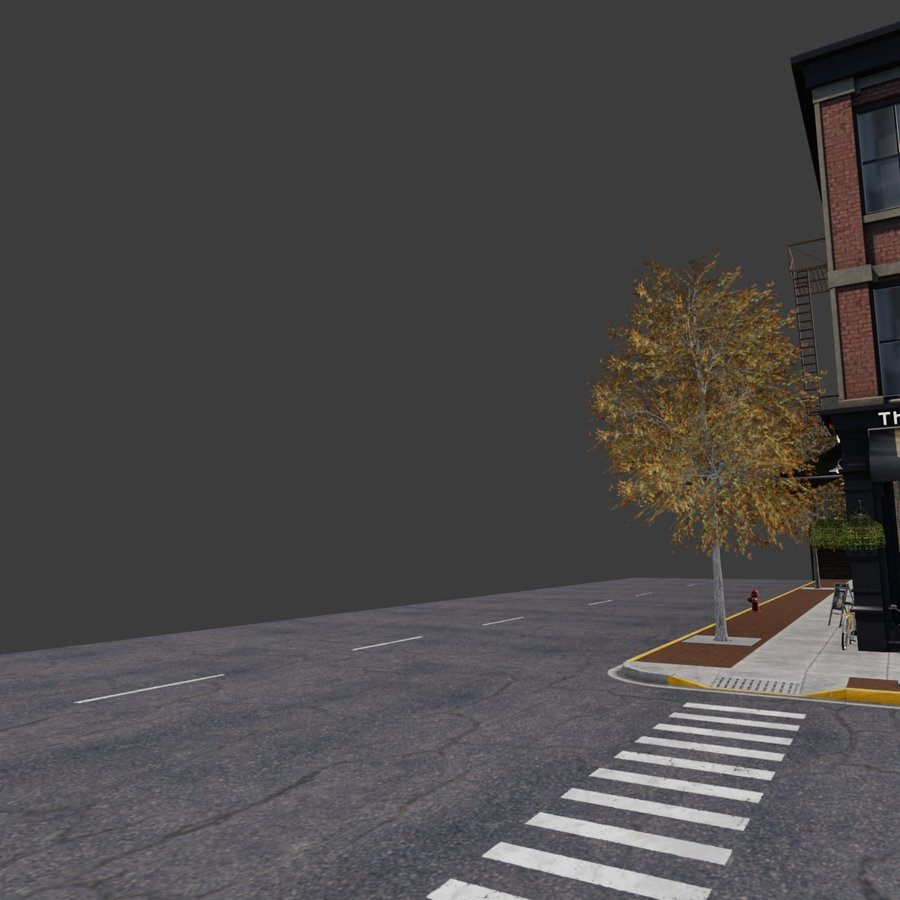

**The full 360.** 10 frames at a 36° step, 164 seconds, stitched to 6756×1198. Seam contrast 1.423, where 1.0 would mean a join is indistinguishable from ordinary picture detail. 29% of it is scene rather than background.

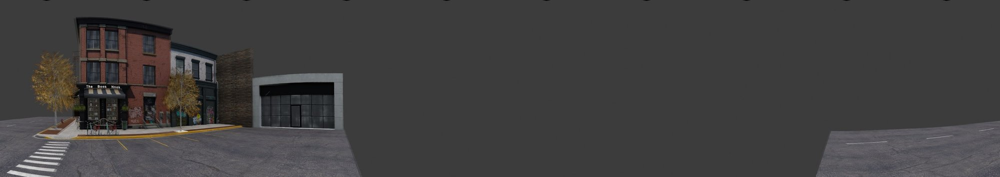

### `store-front`

56 benchmark rows start here, 9 of them needing the full view.

**The camera view.** What the model is shown before it does anything. Captured at 1198x1198.

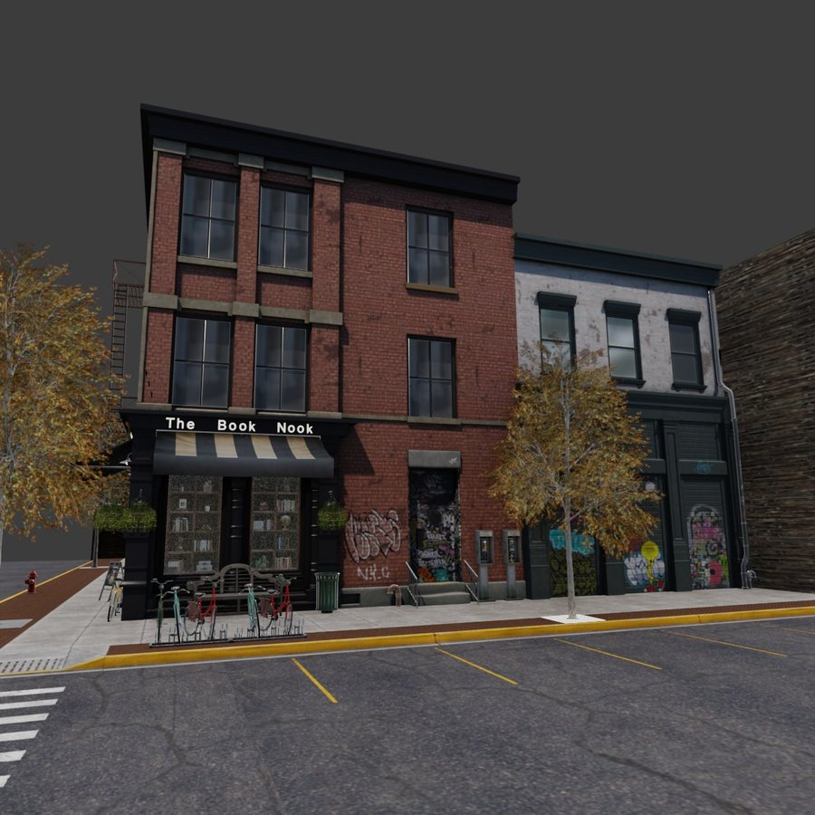

**The full view: `wide110`.** 1 frame at 110.0°, 40 seconds. the strip is mostly empty here, so the cheapest candidate that sees comparably much wins. The strip sees 100% against 99%, inside the metric's own error, and is 26% scene against 55%..

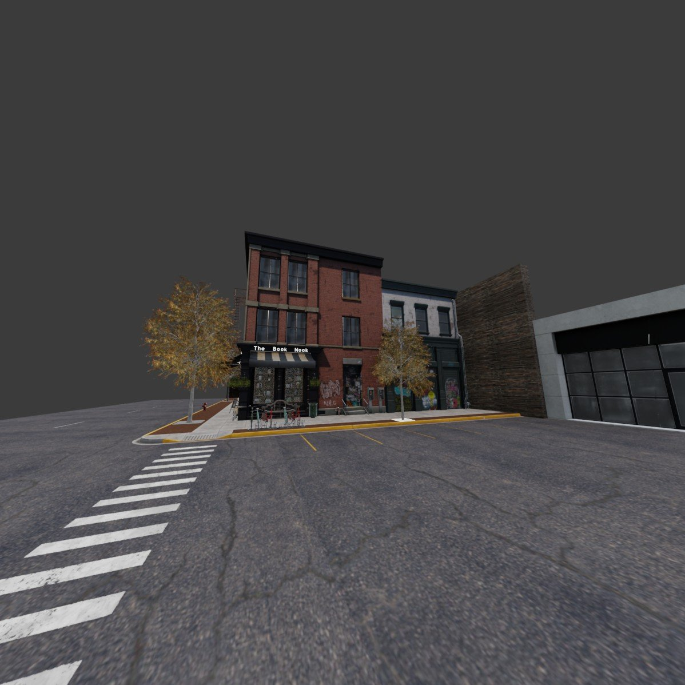

**The 360 sweep, for comparison.** 10 frames at a 36° step, 530 seconds, stitched to 6756×1198. Seam contrast 1.791, where 1.0 would mean a join is indistinguishable from ordinary picture detail. 26% of it is scene rather than background.

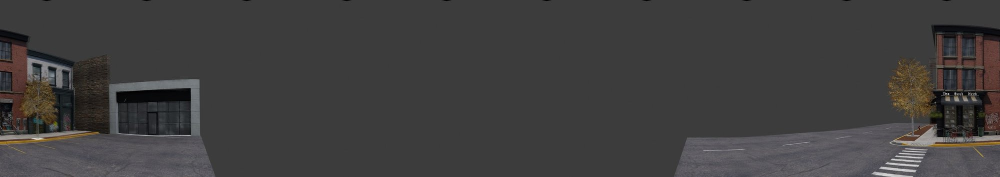

### `store-front2`

56 benchmark rows start here, 9 of them needing the full view.

**The camera view.** What the model is shown before it does anything. Captured at 1198x1198.

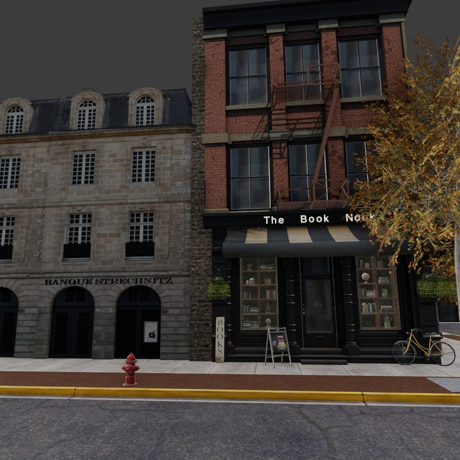

**The full view: `wide90`.** 1 frame at 90.0°, 154 seconds. the strip is mostly empty here, so the cheapest candidate that sees comparably much wins. The strip sees 100% against 100%, inside the metric's own error, and is 34% scene against 71%..

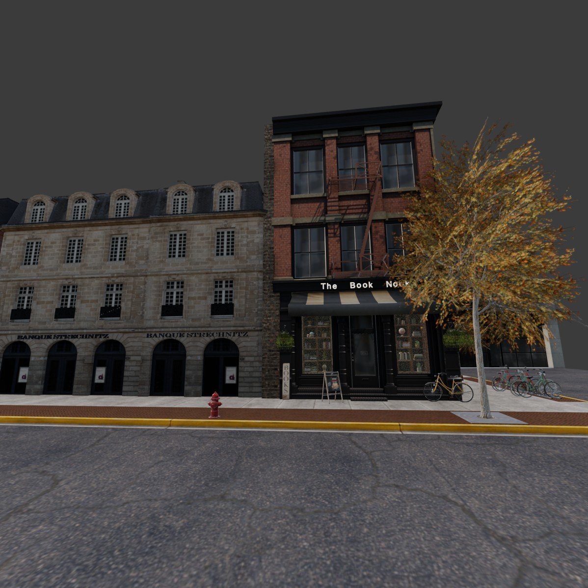

**The 360 sweep, for comparison.** 10 frames at a 36° step, 158 seconds, stitched to 6756×1198. Seam contrast 1.464, where 1.0 would mean a join is indistinguishable from ordinary picture detail. 34% of it is scene rather than background.

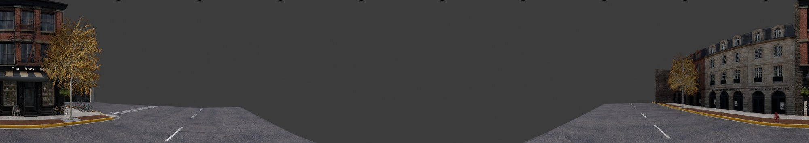

## postwar-city

A bombed-out European street. 46 surface textures are absent and not recoverable; the scene reads correctly without them, with one magenta door and a few flat panels.

### `diff-view-1`

40 benchmark rows start here, 5 of them needing the full view.

**The camera view.** What the model is shown before it does anything. Captured at 1190x669.

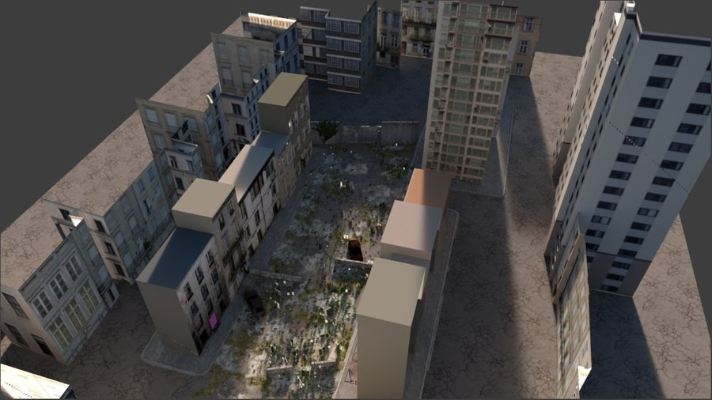

**The full view: `wide90`.** 1 frame at 90.0°, 54 seconds. the strip is mostly empty here, so the cheapest candidate that sees comparably much wins. The strip sees 100% against 100%, inside the metric's own error, and is 32% scene against 56%..


**The 360 sweep, for comparison.** 9 frames at a 40° step, 104 seconds, stitched to 6337×669. Seam contrast 2.39, where 1.0 would mean a join is indistinguishable from ordinary picture detail. 32% of it is scene rather than background.

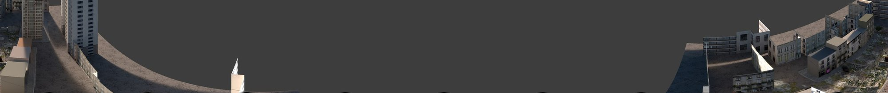

### `street-view-1`

40 benchmark rows start here, 6 of them needing the full view.

This scene is saved at this viewpoint, so applying the preset moves the camera nowhere. The capture is identical to the file as opened, and that is correct rather than a preset failing to apply.

**The camera view.** What the model is shown before it does anything. Captured at 1190x669.

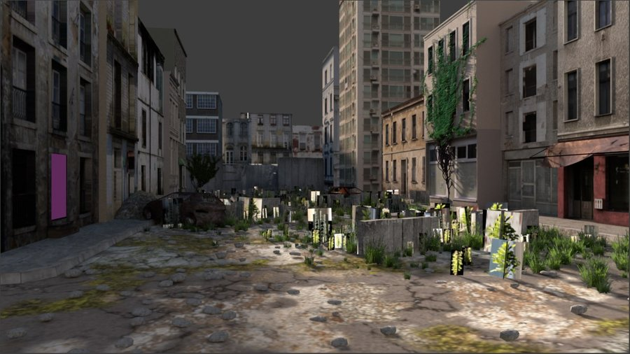

**The full 360.** 9 frames at a 40° step, 67 seconds, stitched to 6337×669. Seam contrast 1.251, where 1.0 would mean a join is indistinguishable from ordinary picture detail. 97% of it is scene rather than background.

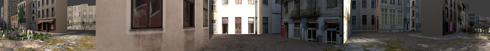

### `street-view-2`

40 benchmark rows start here, 6 of them needing the full view.

**The camera view.** What the model is shown before it does anything. Captured at 1190x669.

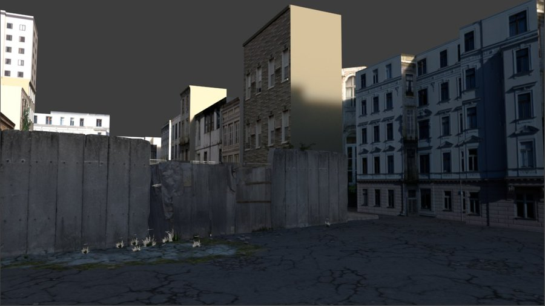

**The full 360.** 9 frames at a 40° step, 62 seconds, stitched to 6337×669. Seam contrast 1.305, where 1.0 would mean a join is indistinguishable from ordinary picture detail. 85% of it is scene rather than background.

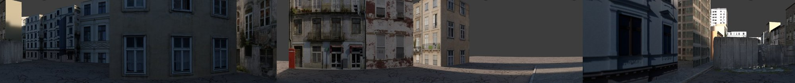

## whitechapel

A rain-soaked Victorian yard. Its environment map has been broken since the scene was authored, which no capture notices, because captures use studio lighting with the scene world off.

### `eor-viewpoint`

68 benchmark rows start here, 10 of them needing the full view.

This scene is saved at this viewpoint, so applying the preset moves the camera nowhere. The capture is identical to the file as opened, and that is correct rather than a preset failing to apply.

**The camera view.** What the model is shown before it does anything. Captured at 1190x669.

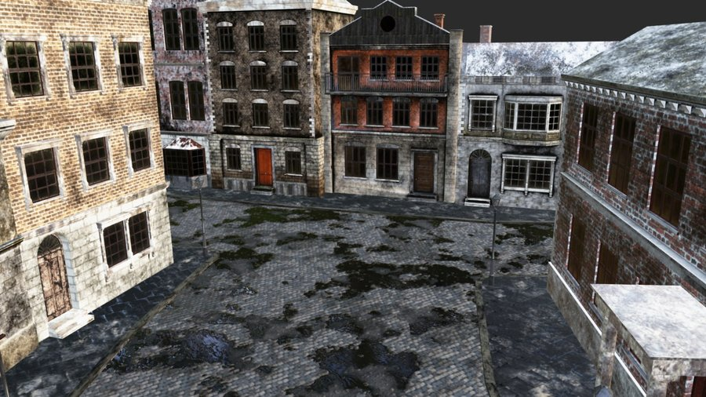

**The full 360.** 10 frames at a 36° step, 191 seconds, stitched to 6570×669. Seam contrast 1.008, where 1.0 would mean a join is indistinguishable from ordinary picture detail. 98% of it is scene rather than background.

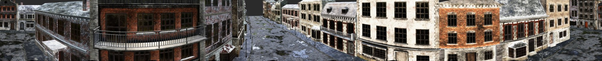

### `sor-viewpoint`

65 benchmark rows start here, 10 of them needing the full view.

**The camera view.** What the model is shown before it does anything. Captured at 1190x669.

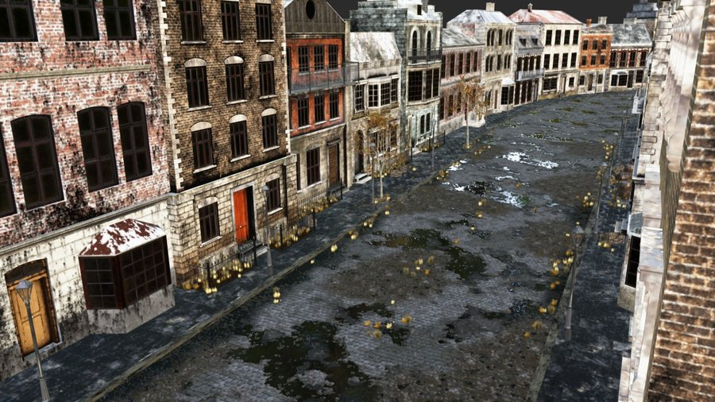

**The full view: `wide110`.** 1 frame at 110.0°, 31 seconds. the strip is mostly empty here, so the cheapest candidate that sees comparably much wins..


**The 360 sweep, for comparison.** 10 frames at a 36° step, 141 seconds, stitched to 6570×669. Seam contrast 10.482, where 1.0 would mean a join is indistinguishable from ordinary picture detail. 33% of it is scene rather than background.

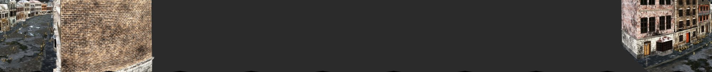

## Reproducing this

```bash
# the camera view at one preset
blender benchmark/scenes/<scene>/<scene>.blend --python scripts/06_verify_setup.py -- out

# a 360 sweep at every preset the benchmark uses, with the pitch A/B
blender benchmark/scenes/<scene>/<scene>.blend \
  --python impl/exp_i_all_panos.py -- out 0.40 0
```

With no real display, add `SCOPE_CAPTURE=opengl`. See [HEADLESS.md](HEADLESS.md), and [COLD_START.md](COLD_START.md) for why a scene needs time before any of this is meaningful.
