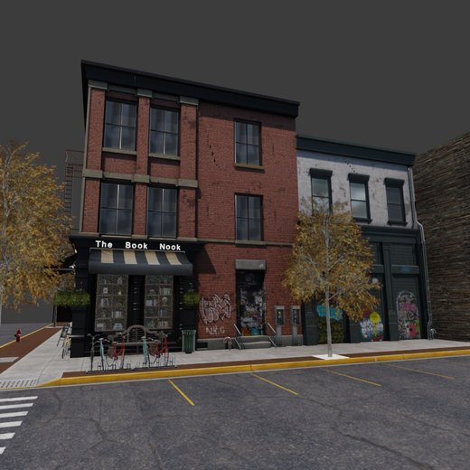
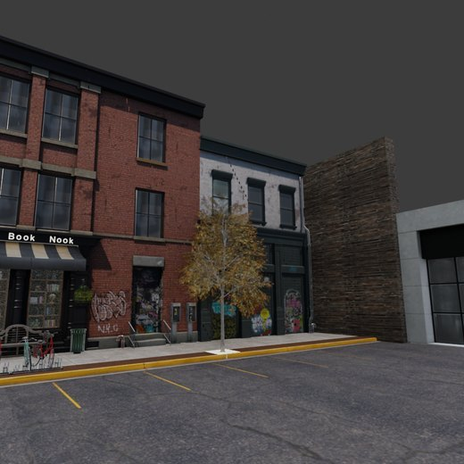
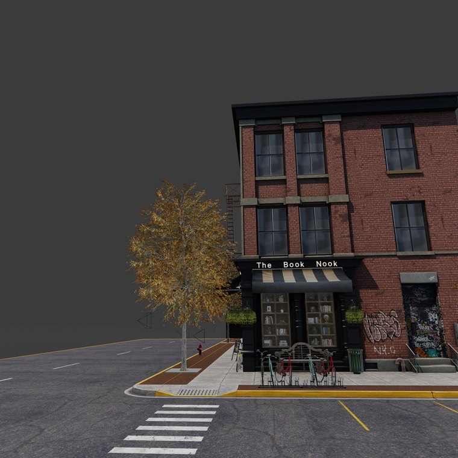
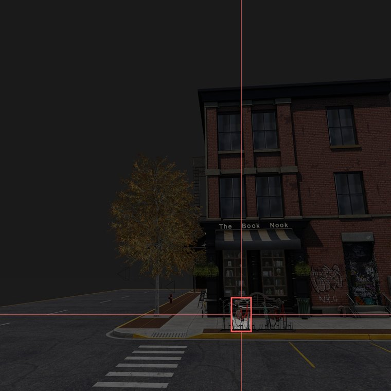
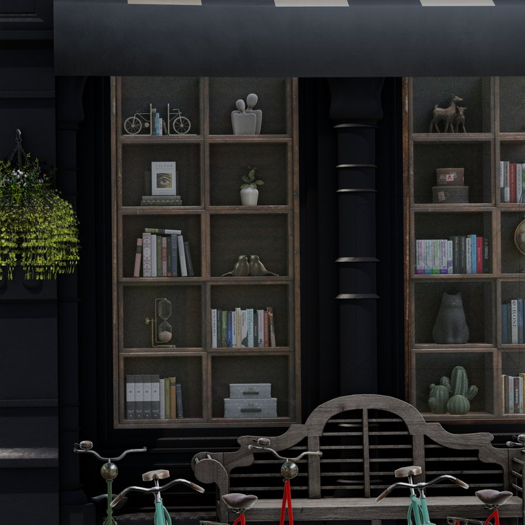

# The tools, demonstrated

Every camera and vision tool SCOPE exposes to a model, called for real and photographed before and after. This is not a description of what the tools are supposed to do; it is a record of what they did, with the numbers measured off the camera afterwards.

Scene `book-nook.blend`, preset `store-front`, 14 of 14 calls behaved as their schema documents.

Regenerate this page with:

```bash
blender <scene.blend> --python impl/tool_smoke_test.py -- smoke_out
SCOPE_SMOKE_VLM=1   # also exercise the tools that need a vision model
```

## Check the picture, not the rotation number

The direction of `pan_deg` was the one thing genuinely in doubt, because internally the tool **subtracts** the value it is given:

```python
cam_obj.rotation_euler[2] -= radians(pan_deg)
```

That looks like an inversion, and `schema.json` tells the model that "go right 10 degrees" means `pan_deg=+10`. Subtracting is what produces a rightward turn in Blender's coordinates, so the code and its description agree, but no amount of reading settles that.

So the check is made on the image. **If the camera turns right, the scene must slide left.** A rotation check passes for an implementation that is internally consistent and still aims the camera the wrong way. A picture that slides the wrong way cannot.

| before | after `ptz_adjust(pan_deg=+15)` |
|---|---|
|  |  |

`pan_deg=+15` slid the picture **109 pixels left**. `pan_deg=-15` slid it **109 pixels right**. `take_image()` moved it **0**, on frames that correlate at 1.000, meaning they are the same picture. Symmetric, and in the direction the schema promises.

The shift is measured from the two published images by column-mean cross correlation over the middle of the frame, so it can be rechecked against the pictures above rather than taken from a log.

## Every call

| call | expected | pan | tilt | lens | picture moved | verdict |
|---|---|---|---|---|---|---|
| `ptz_adjust(pan_deg=+15)` | positive pan_deg should turn right; the tool subtracts, so the angle drops by 15 | -15° | +0° | +0mm | -109 px | as documented |
| `ptz_adjust(pan_deg=-15)` | and back again, which should return the camera to where it started | +15° | +0° | +0mm | +109 px | as documented |
| `ptz_adjust(tilt_deg=+10)` | tilt is added rather than subtracted, so a positive tilt_deg raises the angle | +0° | +10° | +0mm | +0 px | as documented |
| `ptz_adjust(tilt_deg=-10)` | - | +0° | -10° | +0mm | +0 px | as documented |
| `ptz_adjust(zoom_factor=2.0)` | zoom_factor multiplies the focal length, so doubling it adds the original again | +0° | +0° | +28.9mm | n/a | as documented |
| `ptz_adjust(zoom_factor=0.5)` | and back | +0° | +0° | -28.9mm | n/a | as documented |
| `ptz_adjust(zoom_percent=50)` | zoom_percent multiplies by 1 + percent/100 | +0° | +0° | +14.45mm | n/a | as documented |
| `take_image()` | a capture should move nothing | +0° | +0° | +0mm | +0 px | as documented |
| `home_action()` | returns to wherever home was recorded; no fixed expectation | +0° | +0° | +0mm | +0 px | as documented |
| `go_to_preset('store-front')` | should land back on the starting viewpoint | +0° | +0° | +0mm | +0 px | as documented |
| `get_presets()` | - | +0° | +0° | +0mm | +0 px | as documented |
| `query_answer("What is in front of the camera?")` | answering should not move the camera | +0° | +0° | +0mm | +0 px | as documented |
| `count_pointing("bicycle")` | counting should not move the camera either | +0° | +0° | +0mm | +0 px | as documented |

Scripted calls take a fixed argument, so the expected result is arithmetic and a sign error or a wrong factor is caught exactly. Agentic calls take their argument from a vision model looking at the frame, so there is no exact expectation: the check is that the camera moves when it should and stays still when it should not.

## zoom_bounding, end to end

`zoom_bounding("a bicycle")` is the tool with the most moving parts: it captures a frame, asks a vision model to locate something in it, converts that box into a pan, a tilt and a focal length, and moves the camera. Every stage is visible here.

| the frame the model was given | the box it returned | after the camera moved |
|---|---|---|
|  |  |  |

The sign occupies **0.39% of the frame area**, at `[0.5938, 0.7632, 0.6406, 0.8462]` in normalised coordinates. The tool re-aimed by **pan -8.30°, tilt -14.20°** and changed the lens by **+144.5mm**, a **6.0x** zoom. An uncapped fit to that box would be 12.05x; the cap is 6.0x, so the cap was not what limited this call.

The result is a legible shop sign filling the frame, from a call that only knew the words "the bookshop sign".

### When the target is not found

The camera is left where it is and the call says so:

```json
{
  "result": "Could not locate 'the bookshop sign' in the current view. The camera has not moved.",
  "found": false,
  "bbox": null,
  "error": "RuntimeError: VLM is not initialized (call set_vlm(...) or set VLM_* env vars)."
}
```

Check `found` rather than inferring success from the camera. This matters more than it sounds, because three quite different faults used to reach the same fallback and produce byte-identical output, all of it reported as `"Zoomed to target"`:

| what happened | what it is |
|---|---|
| the model cannot see the object | a real answer |
| the model is unreachable or misconfigured | a setup problem |
| the capture came back blank | a setup problem |

The last is the easiest to hit and the hardest to notice. `screenshot_area` returns a solid black image with no error on a virtual display, and a detector shown a black image reports the whole frame as its bounding box, which is exactly what the old fallback produced. With no real display, set `SCOPE_CAPTURE=opengl`; see [HEADLESS.md](HEADLESS.md).

## Related

- [tool_reference.md](tool_reference.md) for the full signature and return shape of each tool
- [COLD_START.md](COLD_START.md) for why a scene needs time before any of this is meaningful
- [SETUP.md](SETUP.md) for which shading mode to capture in, and what each costs
