# Visual smoke test

Four worlds. Ten places the benchmark puts the camera. This page shows what each one looks like, so you can tell at a glance whether your setup is producing the right pictures.

**How to use it.** Run a capture of any viewpoint below and compare it to the picture here. If yours is blank, grey, magenta, or shows a different place, something in your setup is wrong and [SETUP.md](SETUP.md) is where to look. If it looks like the picture, you are fine.

Two pictures per viewpoint:

- **Camera view** is what a model sees when the question starts.
- **Full view** is what it sees after looking around. Some are a 360&deg; sweep, some are a single wide shot, because a sweep is the wrong shape from some positions.

The full-view files are also the ones the benchmark serves. They live in `benchmark/panoramas/` and are loaded rather than recaptured, which is why a full-view question is fast. See [PANORAMA_CACHE.md](PANORAMA_CACHE.md).

## What you should see

| world | place | camera view | full view | questions |
|---|---|---|---|---:|
| `book-nook` | `road1` | [view](../benchmark/preset_views/book-nook__road1.png) | [full](../benchmark/panoramas/book-nook__preset-road1.png) | 56 |
| `book-nook` | `store-front` | [view](../benchmark/preset_views/book-nook__store-front.png) | [full](../benchmark/panoramas/book-nook__preset-store-front.png) | 56 |
| `book-nook` | `store-front2` | [view](../benchmark/preset_views/book-nook__store-front2.png) | [full](../benchmark/panoramas/book-nook__preset-store-front2.png) | 56 |
| `city-street` | `hotel-m` | [view](../benchmark/preset_views/city-street__hotel-m.png) | [full](../benchmark/panoramas/city-street__preset-hotel-m.png) | 61 |
| `city-street` | `mailbox` | [view](../benchmark/preset_views/city-street__mailbox.png) | [full](../benchmark/panoramas/city-street__preset-mailbox.png) | 59 |
| `postwar-city` | `diff-view-1` | [view](../benchmark/preset_views/postwar-city__diff-view-1.png) | [full](../benchmark/panoramas/postwar-city__preset-diff-view-1.png) | 40 |
| `postwar-city` | `street-view-1` | [view](../benchmark/preset_views/postwar-city__street-view-1.png) | [full](../benchmark/panoramas/postwar-city__preset-street-view-1.png) | 40 |
| `postwar-city` | `street-view-2` | [view](../benchmark/preset_views/postwar-city__street-view-2.png) | [full](../benchmark/panoramas/postwar-city__preset-street-view-2.png) | 40 |
| `whitechapel` | `eor-viewpoint` | [view](../benchmark/preset_views/whitechapel__eor-viewpoint.png) | [full](../benchmark/panoramas/whitechapel__preset-eor-viewpoint.png) | 68 |
| `whitechapel` | `sor-viewpoint` | [view](../benchmark/preset_views/whitechapel__sor-viewpoint.png) | [full](../benchmark/panoramas/whitechapel__preset-sor-viewpoint.png) | 65 |

## book-nook

A modern city corner with a bookshop. Only some sides are modelled, so turning right round shows empty space in places. That is the scene, not a fault.

### road1

56 questions start here. 8 of them need the full view.

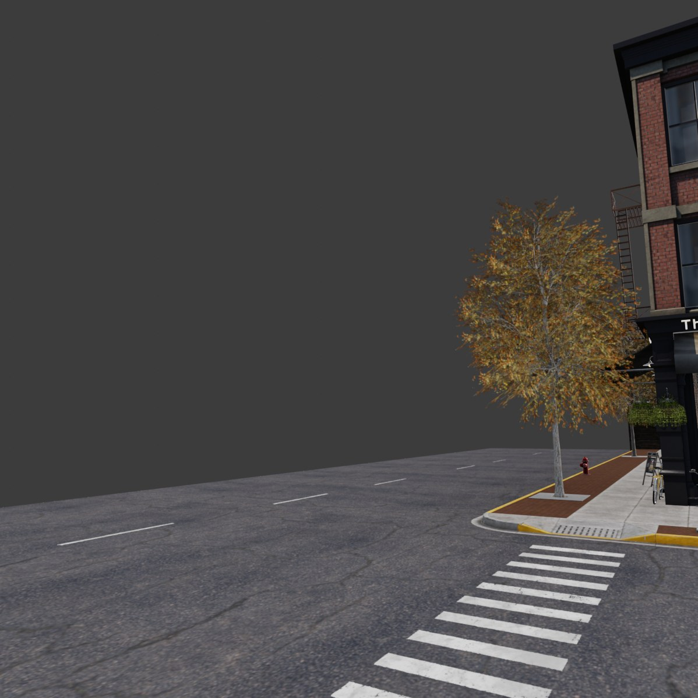

*Camera view. What the model sees first.*

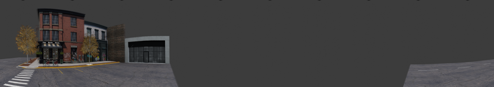

*Full view: 360&deg; sweep.*

### store-front

56 questions start here. 9 of them need the full view.

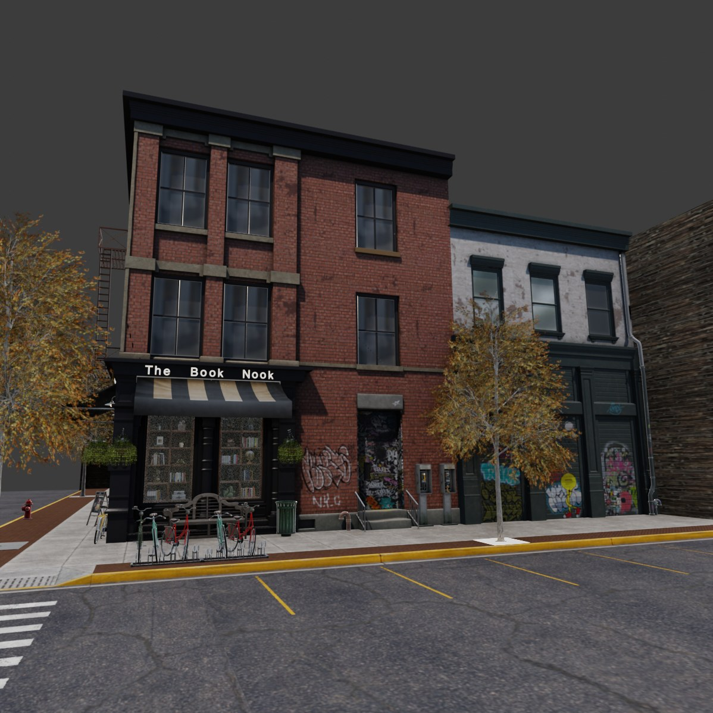

*Camera view. What the model sees first.*

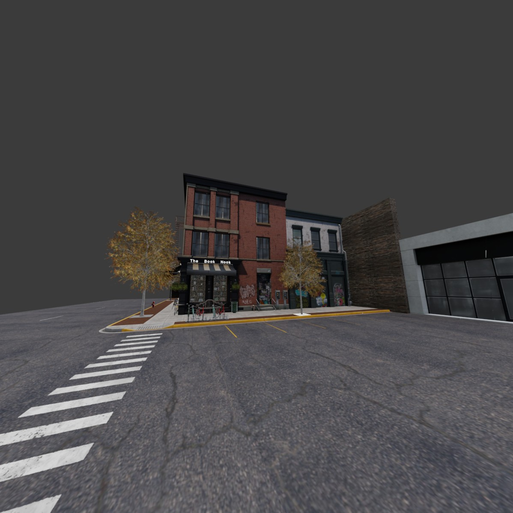

*Full view: single wide shot (wide110).*

### store-front2

56 questions start here. 9 of them need the full view.

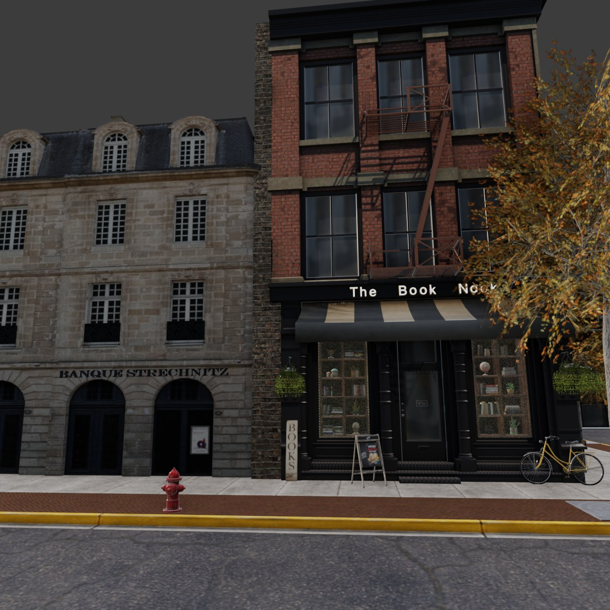

*Camera view. What the model sees first.*

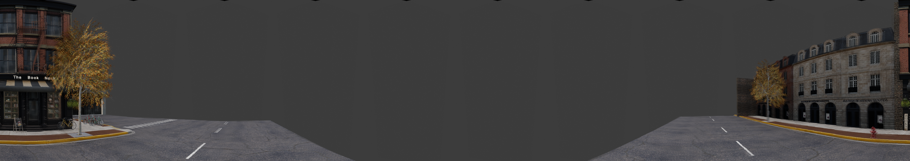

*Full view: single wide shot (wide90).*

## city-street

A one-way street with a hotel. Its full views are grey because this scene is too slow to capture in the normal colour mode on a machine without a graphics driver. Everything else about it is fine.

### hotel-m

61 questions start here. 15 of them need the full view.

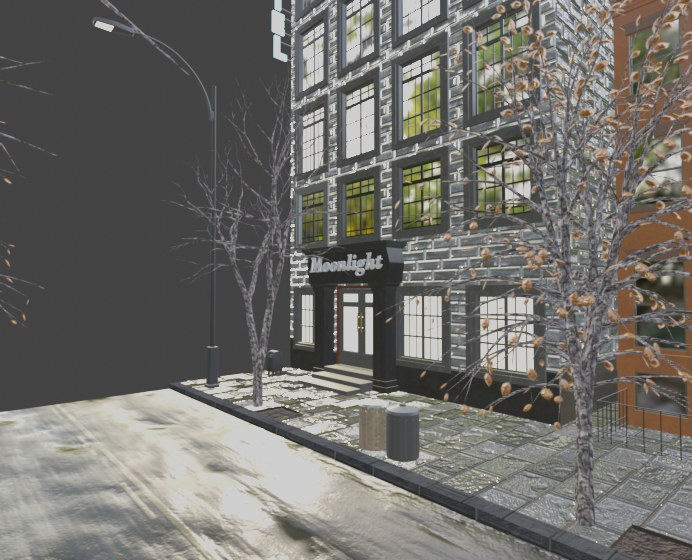

*Camera view. What the model sees first.*

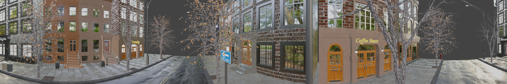

*Full view: 360&deg; sweep. Captured in SOLID+TEXTURE, so it is grey.*

### mailbox

59 questions start here. 15 of them need the full view.

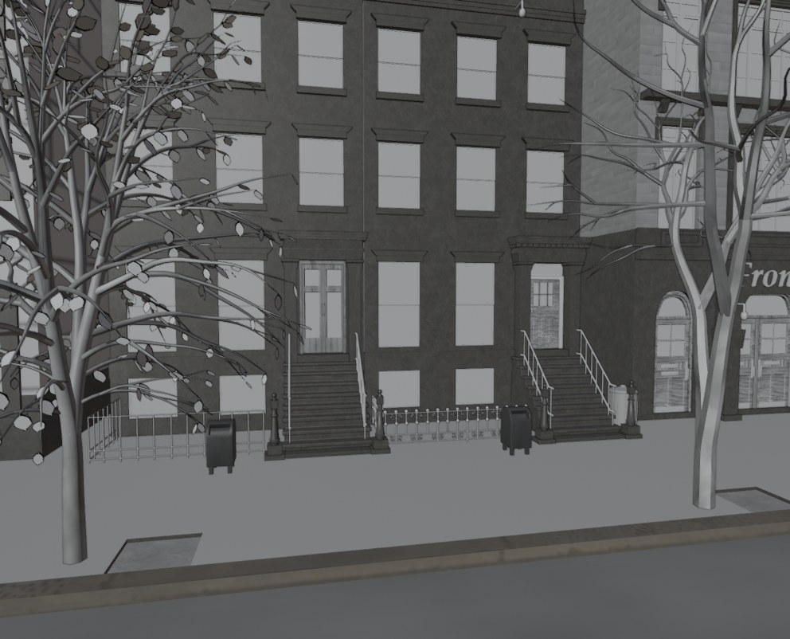

*Camera view. What the model sees first.*

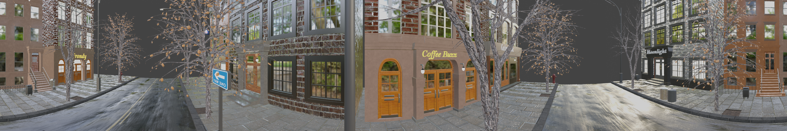

*Full view: 360&deg; sweep. Captured in SOLID+TEXTURE, so it is grey.*

## postwar-city

A bombed-out street. A few surfaces are missing their textures and show as flat panels or one magenta door. Expected, and harmless.

### diff-view-1

40 questions start here. 5 of them need the full view.

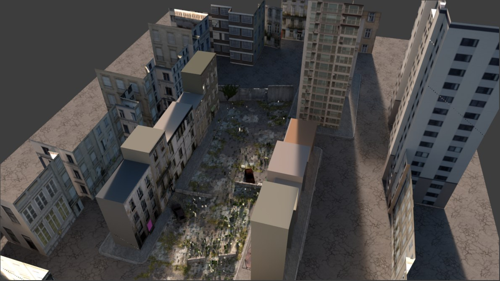

*Camera view. What the model sees first.*

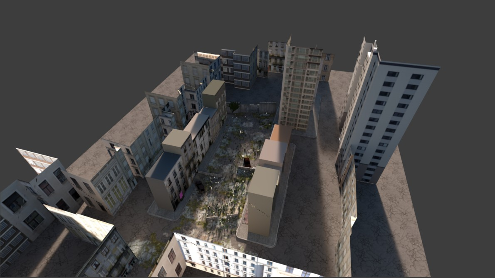

*Full view: single wide shot (wide90).*

### street-view-1

40 questions start here. 6 of them need the full view.

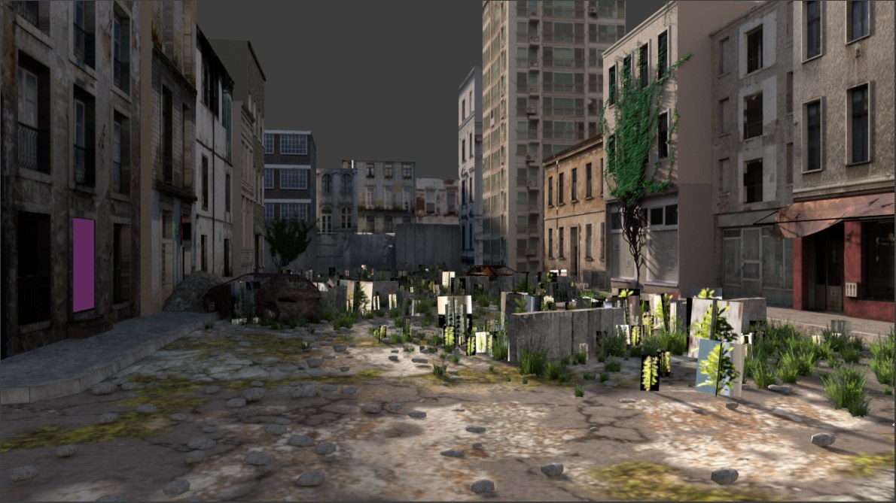

*Camera view. What the model sees first.*

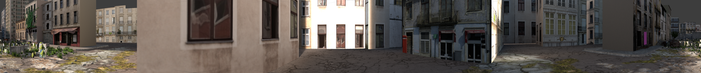

*Full view: 360&deg; sweep.*

### street-view-2

40 questions start here. 6 of them need the full view.

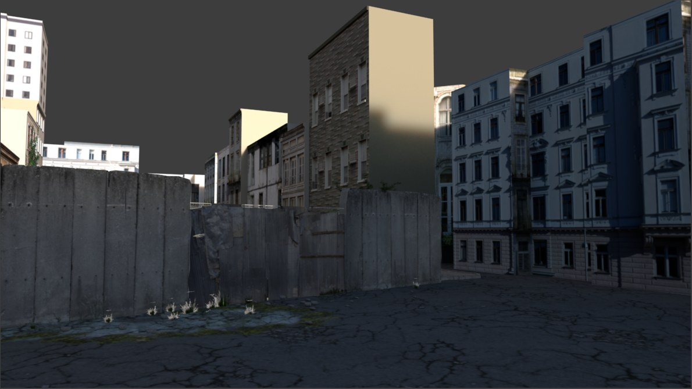

*Camera view. What the model sees first.*

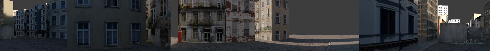

*Full view: 360&deg; sweep.*

## whitechapel

A rain-soaked Victorian yard. Its sky has never worked, which nothing notices, because captures do not draw the sky.

### eor-viewpoint

68 questions start here. 10 of them need the full view.

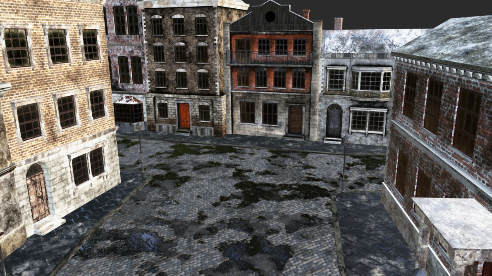

*Camera view. What the model sees first.*

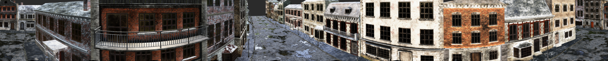

*Full view: 360&deg; sweep.*

### sor-viewpoint

65 questions start here. 10 of them need the full view.

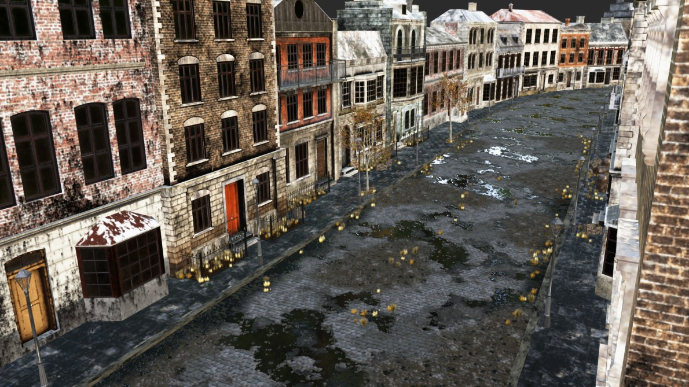

*Camera view. What the model sees first.*

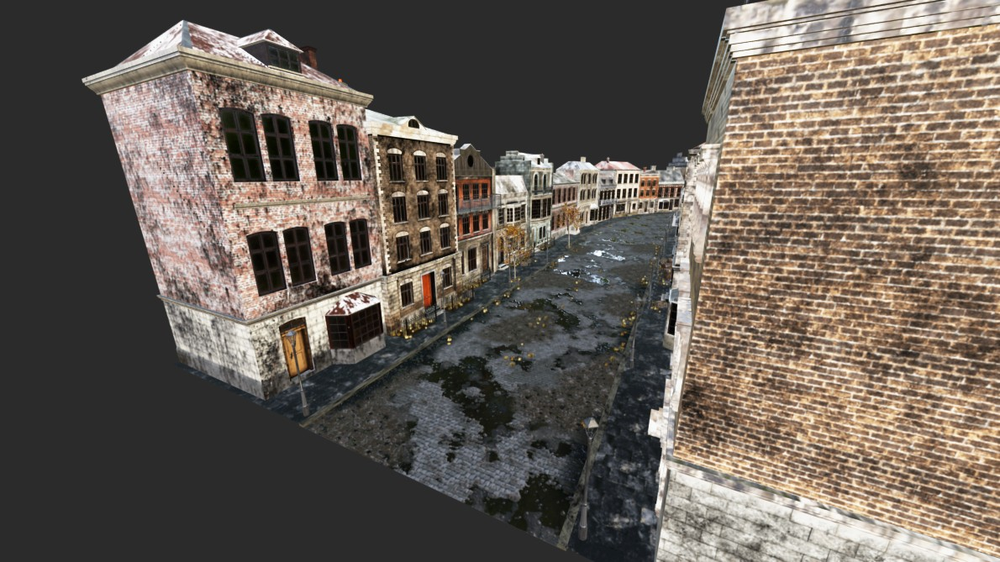

*Full view: single wide shot (wide110).*

## If something does not match

| what you see | what it usually means |
|---|---|
| a black rectangle | no display. Set `SCOPE_CAPTURE=opengl`. See [HEADLESS.md](HEADLESS.md). |
| a small picture in a big grey field | the camera frame is not filling the render. Update; this is fixed. |
| everything magenta | a missing sky is being drawn. Captures should use studio lighting with the scene world off. |
| grey shapes, no textures | Solid shading without textures. See [SETUP.md](SETUP.md). |
| a blank or half-drawn scene | captured too soon after opening the file. See [COLD_START.md](COLD_START.md). |
| the right place, mirrored | an old build. The stitch fix is in `helper_funcs.py`. |
| the wrong place entirely | the preset did not apply. Run `scripts/04_install_presets.py`. |

## Regenerating these

```bash
# one scene, every viewpoint, into the cache these pictures come from
SCOPE_PANO_CACHE=benchmark/panoramas SCOPE_PANO_CACHE_MODE=write \
  blender benchmark/scenes/<scene>/<scene>.blend \
    --python scripts/precapture_panoramas.py
```

Add `SCOPE_CAPTURE=opengl` if there is no display.
