# zoom_bounding, end to end

`zoom_bounding("a doorway")` captures the view, asks a vision model to find the thing, and points the camera at it. Three real calls:

### `zoom_bounding("a window")` — whitechapel / sor-viewpoint

Box covers 2.54% of the frame. Camera turned +24.4°, tilted -4.3°, zoomed 5.092×.

| what the model was given | the box it returned | after the zoom |
|---|---|---|
| 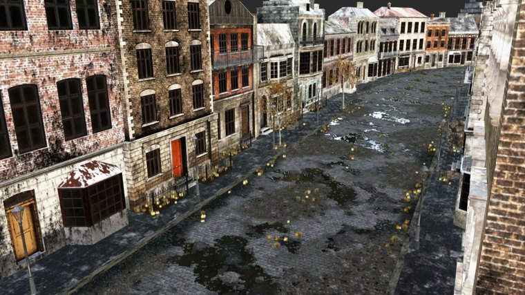 | 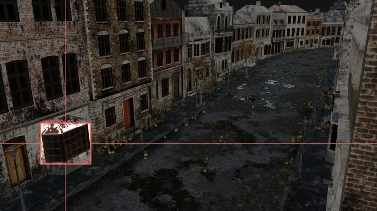 | 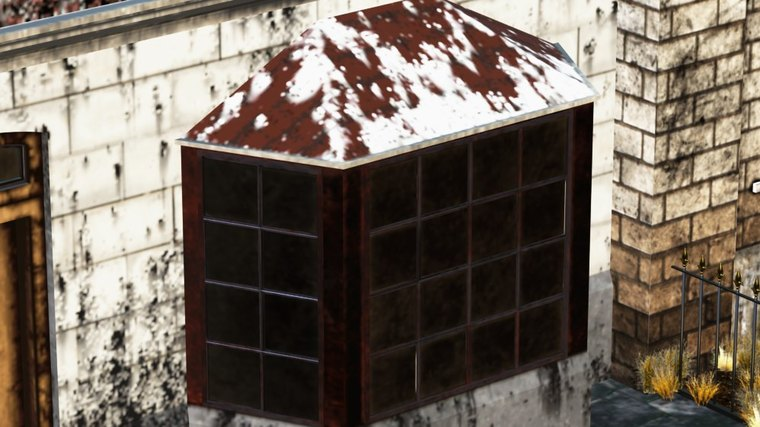 |

### `zoom_bounding("a window")` — postwar-city / diff-view-1

Box covers 0.32% of the frame. Camera turned +43.9°, tilted -2.0°, zoomed 6.0×.

| what the model was given | the box it returned | after the zoom |
|---|---|---|
| 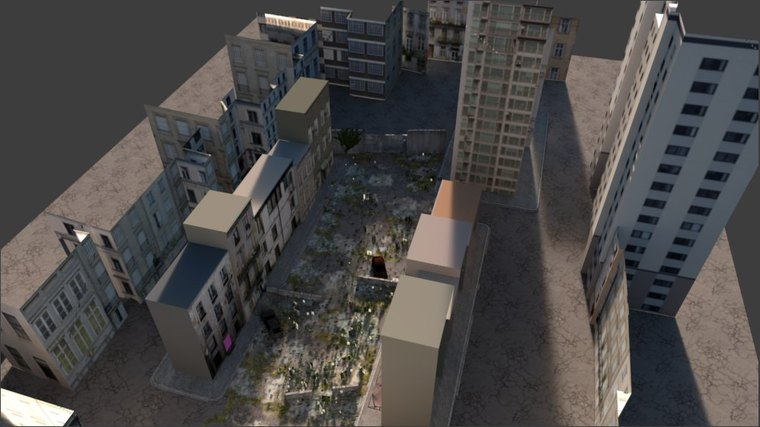 | 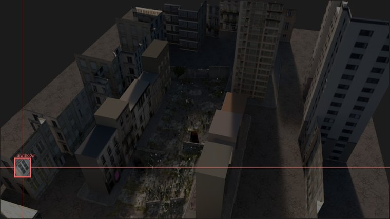 | 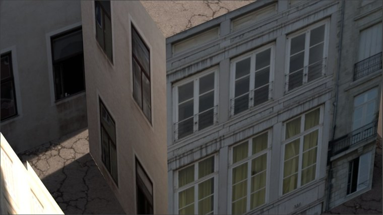 |

### `zoom_bounding("a doorway")` — whitechapel / eor-viewpoint

Box covers 1.25% of the frame. Camera turned +30.4°, tilted -4.1°, zoomed 4.258×.

| what the model was given | the box it returned | after the zoom |
|---|---|---|
| 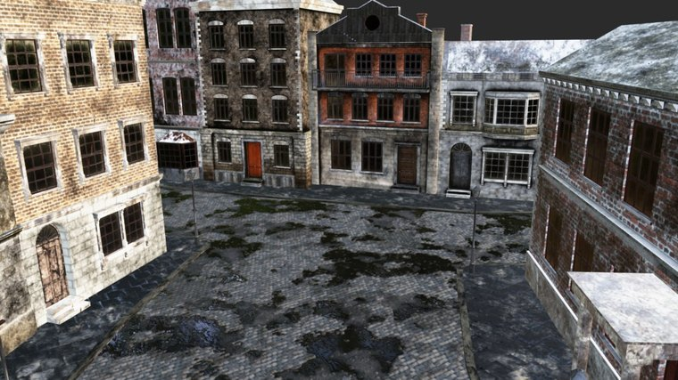 | 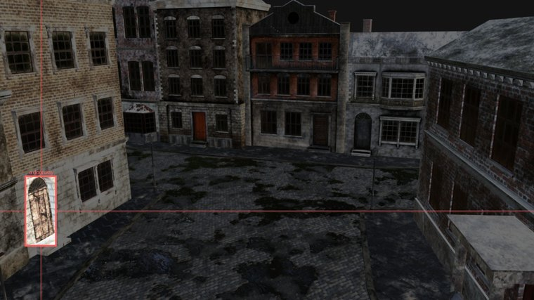 | 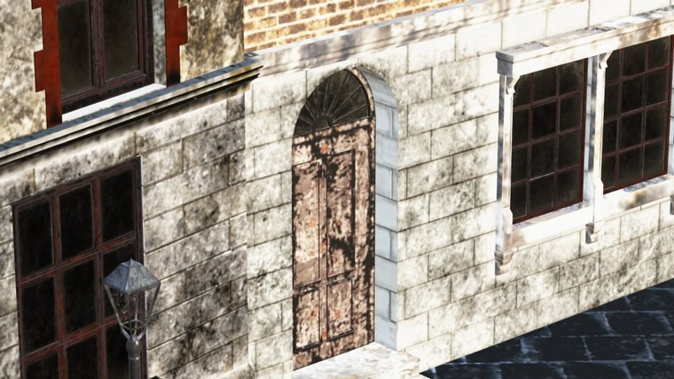 |

<b>Click to see what the same calls did before the aim was fixed.</b> Everything in here is superseded and is kept only to show what changed.

These are `postwar-city/diff-view-1`, the viewpoint that looks down at 48°. Same scene, same instruction, same detected box. Only the aim differs.

| asked for | old aim landed on | current aim lands on |
|---|---|---|
| `a window` | 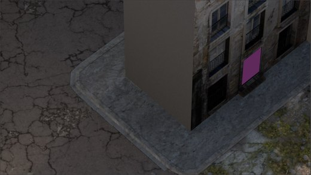 | 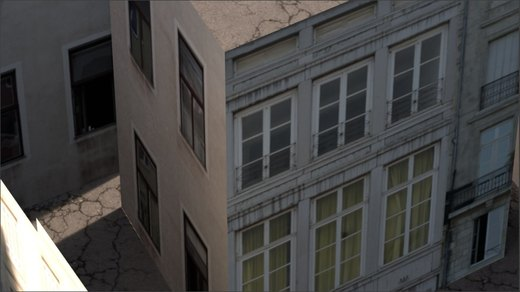 |
| `a doorway` | 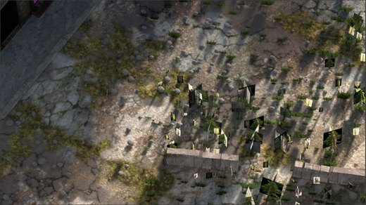 | 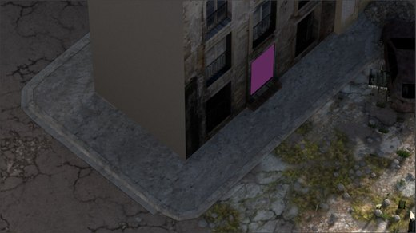 |
| `a balcony` | 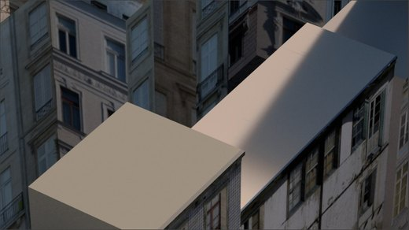 | 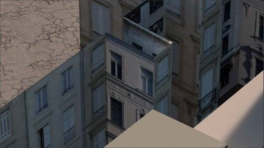 |

